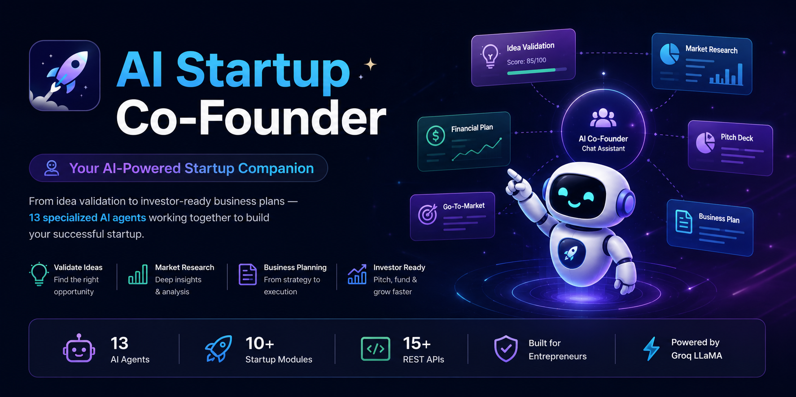
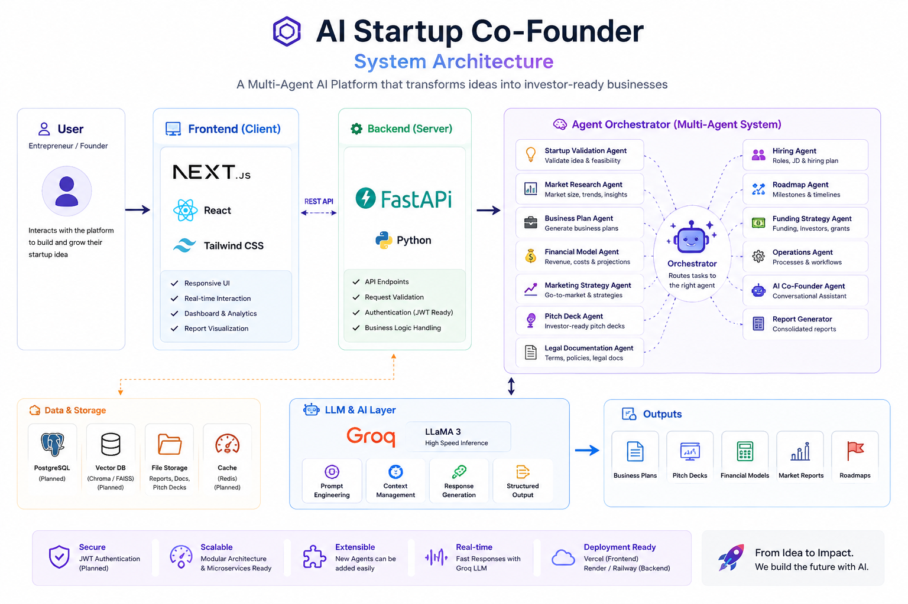

<p align="center">



</p>


<div align="center">

# 🚀 AI Startup Co-Founder

### Your AI-Powered Startup Companion

Transform startup ideas into investor-ready businesses using **13 Specialized AI Agents**.

<p>


</p>

</div>

---

---

# 📖 Overview

AI Startup Co-Founder is an AI-powered platform that helps entrepreneurs transform ideas into structured business plans using a team of specialized AI agents.

Instead of relying on a single chatbot, the platform distributes startup tasks across dedicated agents responsible for idea validation, market research, financial planning, pitch deck creation, marketing strategy, legal documentation, hiring plans, and roadmap generation.

The goal is to reduce the time required to move from an idea to an actionable startup strategy while providing organized, AI-assisted decision support.

---
# ✨ Core Features

| 🚀 Feature | Description |
|------------|-------------|
| 💡 **Idea Validation** | Evaluate startup ideas with AI-powered scoring, SWOT analysis, and opportunity assessment. |
| 📊 **Market Research** | Analyze competitors, identify market trends, estimate market size, and generate customer personas. |
| 💼 **Business Planning** | Create Lean Canvas, Business Model Canvas, pricing strategies, and business roadmaps. |
| 💰 **Financial Planning** | Generate revenue forecasts, expense estimates, break-even analysis, and financial projections. |
| 🎤 **Pitch Deck Generator** | Build investor-ready pitch decks and executive summaries. |
| 📈 **Go-To-Market Strategy** | Receive AI-generated launch plans, marketing strategies, and KPI recommendations. |
| 🤖 **13 Specialized AI Agents** | Dedicated AI agents collaborate to automate startup planning and strategic decision-making. |

---

Watch the complete walkthrough of **AI Startup Co-Founder**, including:

- 💡 Startup Idea Validation
- 📊 Market Research
- 💼 Business Planning
- 💰 Financial Modeling
- 📈 Go-To-Market Strategy
- 🤖 AI Agent Workflow

---

The demo walks through the complete workflow of the platform, including startup validation, market research, business planning, financial modeling, and AI-powered recommendations.


---
# 🏗️ System Architecture

<p align="center">



</p>

The platform follows a modular multi-agent architecture where user requests are processed through a FastAPI backend, coordinated by an Agent Orchestrator, and delegated to specialized AI agents. Each agent focuses on a specific business function such as startup validation, market research, financial modeling, business planning, or investor readiness before generating structured outputs using Groq LLMs.


---
# 🛠️ Technology Stack

### Frontend

<p>


</p>

---

### Backend

<p>


</p>

---

### AI / Machine Learning

- Multi-Agent Systems
- Prompt Engineering
- Groq LLM
- Natural Language Processing
- Startup Intelligence

---

### Development Tools

<p>


</p>

---
---

# 📂 Project Structure

```text
agentic-ai-startup-cofounder/

├── app/
├── backend/
├── components/
├── agents/
├── hooks/
├── public/
├── styles/
├── data/
├── package.json
├── requirements.txt
└── README.md
```

---
# 🚀 Getting Started

## Prerequisites

Make sure you have the following installed:

- Python 3.10+
- Node.js 18+
- npm
- Git

---

## Clone the Repository

```bash
git clone https://github.com/Deepti-Saudari/agentic-ai-startup-cofounder.git

cd agentic-ai-startup-cofounder
```

---

## Frontend Setup

```bash
npm install

npm run dev
```

Frontend runs on:

```
http://localhost:3000
```

---

## Backend Setup

```bash
cd backend

pip install -r requirements.txt

uvicorn main:app --reload
```

Backend runs on:

```
http://localhost:8000
```

---

# 🔑 Environment Variables

Create a `.env` file inside the backend directory.

```env
GROQ_API_KEY=your_groq_api_key
```

---

# 📌 Future Roadmap

- [x] Multi-Agent Architecture
- [x] Startup Validation
- [x] Market Research
- [x] Financial Planning
- [x] Pitch Deck Generation
- [x] Business Planning
- [ ] Authentication
- [ ] Team Collaboration
- [ ] PDF Export
- [ ] Analytics Dashboard
- [ ] Cloud Deployment
- [ ] Live Demo

---

# 🤝 Contributing

Contributions are welcome.

1. Fork this repository
2. Create a feature branch

```bash
git checkout -b feature-name
```

3. Commit your changes

```bash
git commit -m "Add new feature"
```

4. Push your branch

```bash
git push origin feature-name
```

5. Open a Pull Request

---

# 📄 License

This project is licensed under the **MIT License**.

---

# 👩‍💻 Author

**Deepti Saudari**

- 📧 saudarideepti@gmail.com
- 💼 https://www.linkedin.com/in/deepti-saudari/
- 🐙 https://github.com/Deepti-Saudari

---

<div align="center">


It helps others discover the project and motivates future improvements.


</div>
